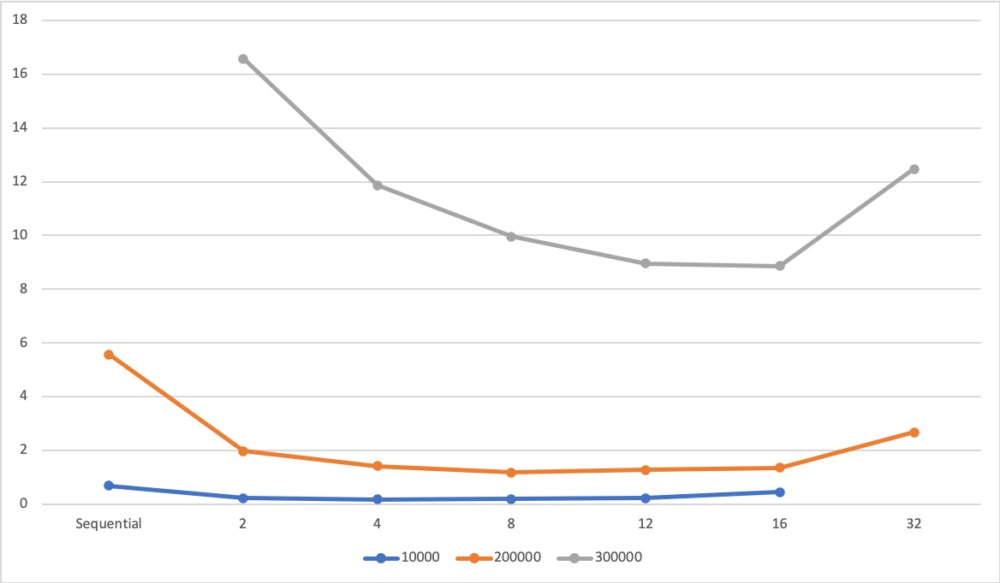
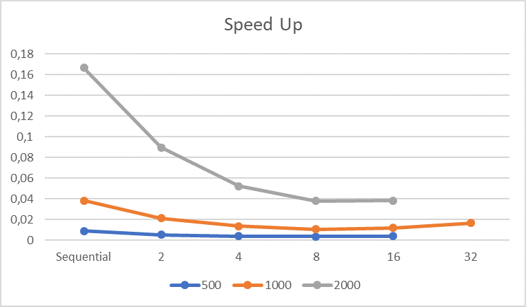
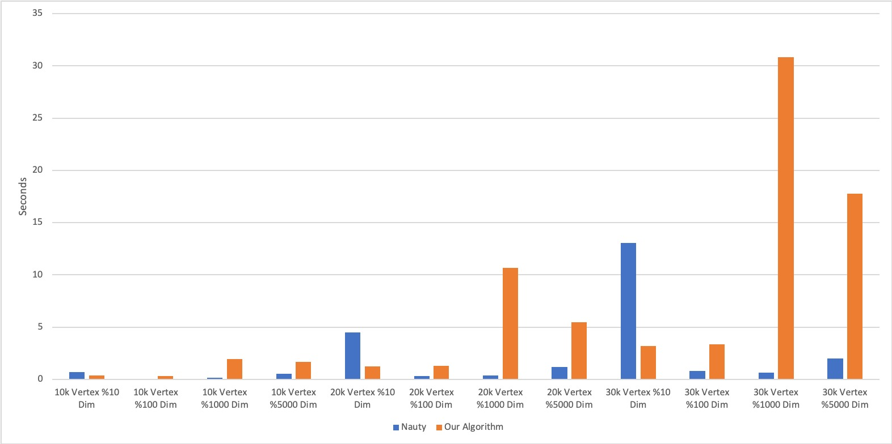

# Parallel-Graph-Isomorphism

### Usage:
To run an experiment with 10k,20k,30k vertices and 10, 100, 1000, 5000 edges per vertex:  
compile nauty by running make command in nauty26r12  
g++ gen_and_solve2.cpp nauty26r12/nauty.a   
./a.out  
You will see the generated graphs at graphs2 dir. Also there will be a file nauty_times.txt with execution times of nauty to solve  the isomorphism.  

To solve an instance of the problem with our code: 
g++ -fopenmp main.cpp graphio.cpp 
./a.out filename (graphs2/20000v_10d_c1.txt) vertexcount (20000) ---------> v : vertex, d : edge per vertex, c: graphnum (first such graph, second such graph etc) 
ex: ./a.out graphs2/20000v_10d_c1.txt 20000 

## Description of Application
We plan to implement a parallel algorithm to solve the graph isomorphism problem. Informally, graph isomorphism problem is deciding whether two given graphs have the same structure. Given two graphs G1 = (V1,E1) and G2 = (V2,E2), an isomorphism from G1 to G2 is a bijection f : V1 → V2 such that (i,j) ∈ E1 if and only if (f(i),f(j)) ∈ E2. If such an isomorphism exists, the graphs are called isomorphic. Graph isomorphism problem is known to be in NP but not known whether it is NP-complete or in P. Since there is no algorithm to solve the problem in polynomial time, we assume the task is complex enough for our project. 
	Also, the more general problem of finding isomorphisms in subgraphs is known to be NP-complete, but we are going to focus on graph isomorphism in this project.
	
## Data and Model Description
Graph isomorphism simply means that there is bijection between given graphs. In other words, each node can be assigned to a node in the other graph while preserving all its connection and edge features. In our model we aim to evaluate the existence of the bijection function between two graphs. Since adjacency matrices contain all the information about the graph, they are one of the most suitable structures to represent and compare graphs.
Adjacency matrix is an nxn matrix, where n is the number of nodes in the graph, to represent finite graphs. In the matrix columns and rows are labeled with the vertices. For a simple graph, elements of the graph are assigned to either 1 or 0. If there exists a path from vertex v to vertex vj then the corresponding matrix element aij= 1. Otherwise aij= 0. 

Since the graphs we will work on can get big, we wanted to cut corners with memory usage and use a vector of vectors to hold graph information. It is a list of edges from each vertex. 

## Algorithm
Our algorithm is composed of 2 main classes. The first class is called “Graph” which includes information regarding vertices and edges. Also, there is another variable which is the matrix that keeps all the shortest path information from every vertex to every other vertex. The second class is called “GraphMapper” which contains 2 graph objects and a function named “Solve” which tries to find isomorphism between 2 graph object.

In the Solve function, it first checks whether 2 graphs have the same number of vertices. Because, if they do not have the same number of vertices, they cannot be isomorphic and function returns.

Then, the preprocessing part begins. First, the algorithm checks for the degree number for each vertex in both graphs. Degree number is the number of edges a vertex has. Here, we have a hashmap where the key is degree, and value is pair of 2 sets. The first set is the set of vertices in the first graph which have the degree number as the key. The second set is the set of vertices in the second graph which have the degree number as the key. After we process all the vertices, then we check whether for a degree number, both graph has the same number of vertices with the corresponding degree. If not, we can directly tell that graphs cannot be isomorphic.

In the next step, we define a vector of possible mapping sets. In this variable, indexes are the vertices of graph 1, and the elements are the set of vertices from graph 2 where there could be a possible map to the corresponding vertex of graph 1. Here for a vertex of graph 1, the possible map vertices of graph 2 are taken from previously defined hashmap, such that these vertices of graph 2 have the same number of edges with the specified vertex of graph 1. So, possible map vertices in both graphs means that they have the same degree number.

After setting possible mappings, we set the shortest path to all vertices algorithm in each graph which is going to be used as a filter in the following steps to eliminate impossible mappings.

Before we move on to a brute force method, we first check whether some of the possible mappings have an only option or not for a map. If this is the case, then we set this as a found map between one vertex to another in both graph. After we set this, we call a shortest path filter. Shortest path filter iterates all the possible mappings and eliminates some of the certainly not possible mappings. For example we have a certain map with vertex1 in graph 1 and vertex2 in graph 2. Then while we are checking the possibility of mapping of 2 vertices, let’s call vertex3 in graph 1 and vertex4 in graph 2, we check an equality such as;
→shortest_path[vertex1, vertex3] = shortest_path[vertex2, vertex4]
If the above equality holds, vertex3 and vertex4 remain as possible mapping. Otherwise, we erase vertex4 out of vertex3’s possible mapping set.

After the above steps, if we do not find a certain map for all of the vertices, we go for the exhaustive search and try some possible mapping as if they are certain. While we are doing this, we copy all the information about possible mappings to a temporary variable and move forward with this temporary variable. After we try a map, we call again the shortest path filter at each try. After the shortest path filter, we check whether the current condition of the graph is violating isomorphism or not. Since the shortest path filter eliminates some of the mapping which are not possible, we may remain with a vertex of graph 1 which does not have any possible map. In such a case, we say the current try fails. Otherwise, if it does not violate isomorphism, we go on trying new possible mappings as a recursive call. In the end, as a root condition of a recursive call, if it does not violate isomorphism after trying all the mappings, this means we reach a solution. Then, we set this final state to a variable called “finalVertexMap” of the “GraphMapper” class.

## Parallelism
We have so far only used openmp for parallelism. Since we deal with array or matrix structures omp for method is suitable for parallelism. Omp for is used in several functions such as updating the possible matching of each vertex or finding the shortest path. For shortest path finding, inside of setShortestPathAllVertices function that we parallelized, which calculates shortest paths for all vertices in the graph by using breadth first seatch. Shortest paths are calculated for the both graphs which are independent of each other. Therefore we can also parallelize these processes. To achieve parallelization, we divide these processes to separate tasks by using omp task.
 As a future work before the final step, we will also apply parallelism for recursive brute force search where the task parallelism is very applicable for this part. Also, some operations that we do such as ShortestPathFiltering can be parallelised for GPUs.

## Calculation Times and Speedups
Speed of the algorithm is improved even more since the progress report. First graphic shows the execution time of graphs of 500/1000/2000 vertices as the number of threads increasing. We have tested the final version of the code under the same conditions to see the progress better. As it can be seen in the graphics below timing results are 100 times are better.
| | |

Also we've compared our algorithm with the nauty algorithm (state-of-art) in bigger graphs. Since density of the graphs affect the speed of the algorithms we had created graphs with same size but different densities. Algorithms are tested on graphs of 10k 20k 30k nodes. Number of neighbours of a node (i.e. density) varies from 10 to 5k. When it comes to sparse graphs our algorithm runs faster than the nauty algorithm. Since nauty algorithm is more suitable for dense graphs, in dense graphs, timing result of our algorithm is not better than the nauty. 

